<!--
author:   Claude Agent SDK Course
email:    training@example.com
version:  1.0.0
language: en
narrator: US English Female
comment:  Section 4 of the Claude Agent SDK course — permissions, allow/deny rules, permission modes, PreToolUse hooks, and a fully layered Safe Code Review Agent. Interactive tutorial for LiaScript.
mode:     Textbook

import: https://raw.githubusercontent.com/LiaTemplates/mermaid_template/0.1.4/README.md


script:   https://cdn.jsdelivr.net/npm/mermaid@10.5.0/dist/mermaid.min.js


@onload
mermaid.initialize({ startOnLoad: false });
@end

@mermaid: @mermaid_(@uid,```@0```)

@mermaid_
<script run-once="true" modify="false" style="display:block; background: white">
async function draw () {
    const graphDefinition = `@1`;
    const { svg } = await mermaid.render('graphDiv_@0', graphDefinition);
    send.lia("HTML: "+svg);
    send.lia("LIA: stop")
};

draw()
"LIA: wait"
</script>
@end

@mermaid_eval: @mermaid_eval_(@uid)

@mermaid_eval_
<script>
async function draw () {
    const graphDefinition = `@input`;
    const { svg } = await mermaid.render('graphDiv_@0', graphDefinition);
    console.html(svg);
    send.lia("LIA: stop")
};

draw()
"LIA: wait"
</script>
@end

-->

# Permissions and Safety

## Claude Agent SDK

This section introduces the permission and safety mechanisms used to control
agent tool access. By the end, you will be able to trace a tool request
through the SDK's evaluation flow, configure read-only and auto-edit agents,
write `PreToolUse` hooks that block or redirect dangerous operations, and
assemble all of it into a single, layered, production-safe agent.

An agent can request tools such as:

- `Read`
- `Glob`
- `Grep`
- `Write`
- `Edit`
- `Bash`
- `AskUserQuestion`

The Claude Agent SDK provides several mechanisms for controlling these
operations:

| Mechanism | Purpose |
|---|---|
| `allowed_tools` | Pre-approves tools |
| `disallowed_tools` | Explicitly denies tools or matching patterns |
| `permission_mode` | Defines permission behavior |
| `canUseTool` | Handles application-controlled permission decisions |
| `PreToolUse` | Inspects and controls tool calls before execution |

These controls are independent and can be combined to create agents with
different levels of autonomy and safety.

<!--
Quick pulse-check before diving in — this reinforces the "independent controls" framing from the intro.
-->

Quick check before we start:

  [[X]] `allowed_tools`, `disallowed_tools`, and `permission_mode` are independent controls that can be combined.
  [[ ]] Only one permission mechanism can be active in an agent at a time.

---

## Table of Contents

1. [Permission Evaluation](#1-permission-evaluation)
2. [Allowed Tools](#2-allowed-tools)
3. [Disallowed Tools](#3-disallowed-tools)
4. [Permission Modes](#4-permission-modes)
5. [Read-Only Agents](#5-read-only-agents)
6. [Auto-Edit Agents](#6-auto-edit-agents)
7. [Hooks](#7-hooks)
8. [Blocking Dangerous Bash Commands](#8-blocking-dangerous-bash-commands)
9. [Protecting Sensitive Paths](#9-protecting-sensitive-paths)
10. [Modifying Tool Input](#10-modifying-tool-input)
11. [User Input and `canUseTool`](#11-user-input-and-canusetool)
12. [Layered Safety](#12-layered-safety)
13. [Safe Code Review Agent](#13-safe-code-review-agent)
14. [Running the Notebooks](#14-running-the-notebooks)
15. [Reference](#15-reference)

---

# 1. Permission Evaluation

Every tool call the model wants to make passes through a fixed evaluation
pipeline before it is allowed to run. Understanding this order is the single
most important idea in this section — nearly every "gotcha" later on comes
back to *which gate ran first*.

When Claude requests a tool, the request is evaluated before the tool
executes.

The evaluation order used in this section is:

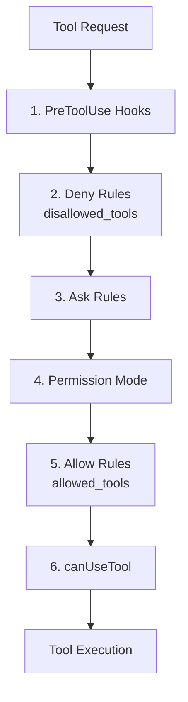

A request can result in one of three outcomes:

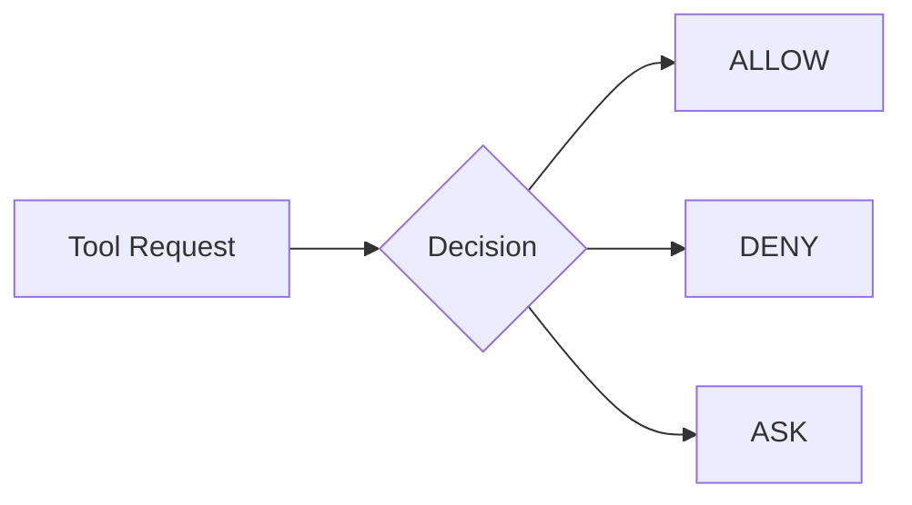

This six-gate evaluation process runs in this exact order for every tool call,
with no exceptions.

## Working Directory

Filesystem examples should explicitly define the working directory:

```python
ClaudeAgentOptions(
    cwd=".",
    ...
)
```

The built-in tools perform their own path-scope checks before the permission
gates. If a tool seems to fail despite being allowed, check `cwd` first —
that's usually the real cause.

---

# 2. Allowed Tools

`allowed_tools` is the first control most people reach for, and also the
source of the most common misunderstanding: people assume it works like a
firewall, blocking everything not on the list. It doesn't. Read this section
carefully before moving on.

`allowed_tools` specifies tools that are pre-approved.

```python
ClaudeAgentOptions(
    cwd=".",
    allowed_tools=[
        "Read",
        "Glob",
        "Grep",
    ],
    permission_mode="dontAsk",
)
```

The tools are pre-approved:

```text
Read
Glob
Grep
```

`allowed_tools` is a pre-approval mechanism. An unlisted tool can continue
through the remaining permission evaluation — it is not blocked by the list
itself.

Conceptually:

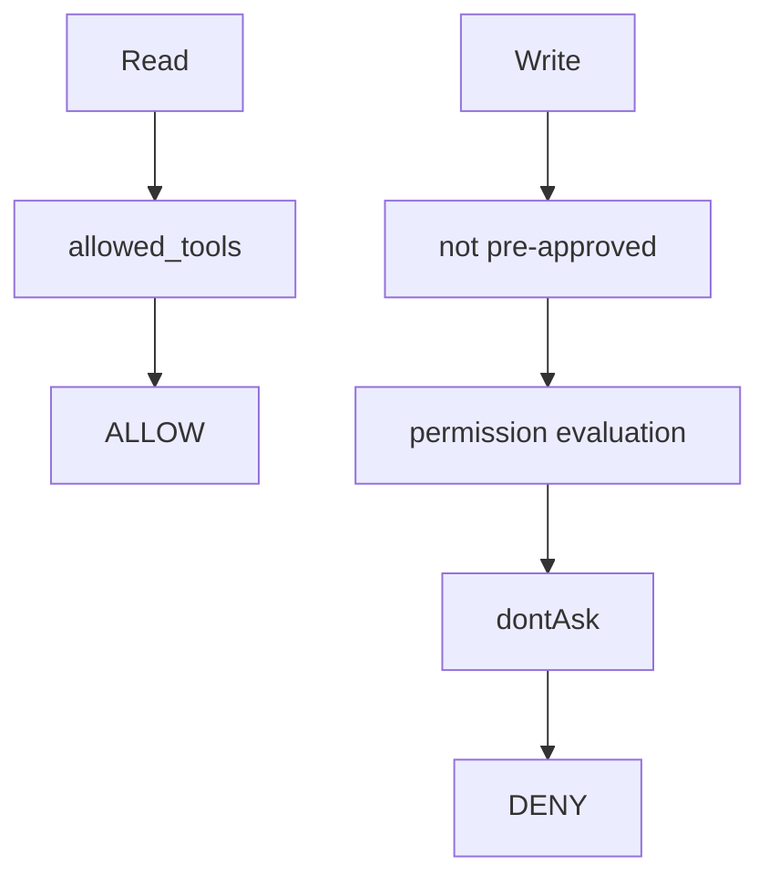

`Write` above is denied because `dontAsk` denies anything unresolved — not
because `allowed_tools` removed it from consideration.

  [[X]] `allowed_tools` pre-approves listed tools; unlisted tools still fall through to the rest of the evaluation.
  [[ ]] `allowed_tools` removes every unlisted tool from the model's awareness entirely.

---

# 3. Disallowed Tools

Where `allowed_tools` pre-approves, `disallowed_tools` is the mechanism for a
hard, explicit block — and it is evaluated *earlier* in the pipeline than
`allowed_tools`, which has real consequences you'll see below.

`disallowed_tools` explicitly denies a tool or matching pattern.

To deny Bash completely:

```python
ClaudeAgentOptions(
    disallowed_tools=[
        "Bash",
    ],
)
```

A restriction can also be scoped:

```python
ClaudeAgentOptions(
    disallowed_tools=[
        "Bash(rm *)",
    ],
)
```

This allows the broader Bash capability while denying the matching operation.

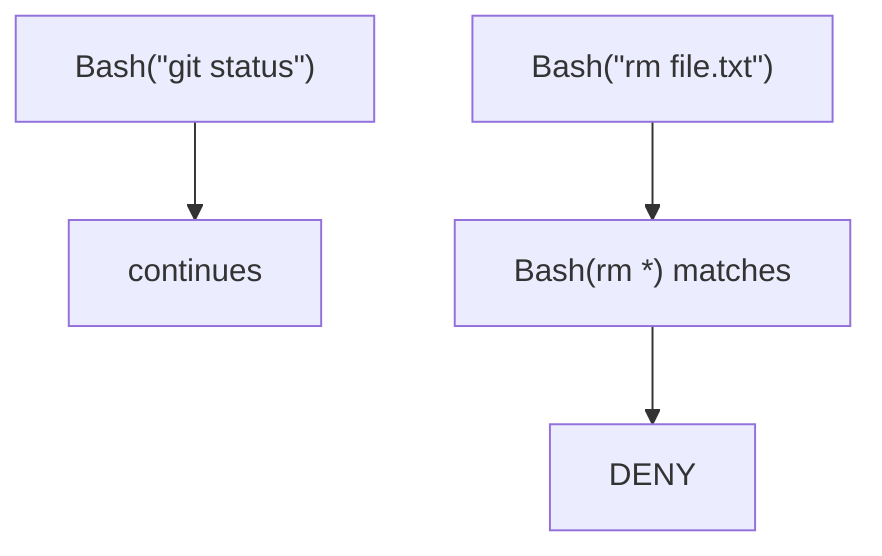

Deny rules are evaluated before allow rules.

## Allow and Deny Together

```python
ClaudeAgentOptions(
    allowed_tools=[
        "Bash",
    ],
    disallowed_tools=[
        "Bash(rm *)",
    ],
)
```

This configuration means:

```text
Bash
    → generally available

Bash(rm *)
    → explicitly denied
```

This pairing — broad allow, narrow scoped deny — is one of the most useful
patterns in this whole section. It lets an agent keep a genuinely useful tool
while still ruling out its most dangerous invocations.

---

# 4. Permission Modes

While `allowed_tools` and `disallowed_tools` control individual tools,
`permission_mode` sets the *default* behavior for everything that isn't
already resolved by a rule. Think of it as the fallback policy.

The permission modes covered in this section are:

| Mode | Description |
|---|---|
| `default` | Uses normal permission handling |
| `acceptEdits` | Automatically approves supported editing operations |
| `plan` | Allows exploration and planning without automatically approving edits |
| `bypassPermissions` | Broadly approves permissions; use with extreme caution |
| `dontAsk` | Denies requests that are not already approved |

## `default`

```python
ClaudeAgentOptions(
    permission_mode="default",
)
```

Unresolved requests use the normal permission handling process.

## `acceptEdits`

```python
ClaudeAgentOptions(
    permission_mode="acceptEdits",
)
```

Supported file editing and filesystem operations are automatically approved
within the working directory.

## `plan`

```python
ClaudeAgentOptions(
    permission_mode="plan",
)
```

The agent can explore and construct a plan. File edits are not automatically
approved.

## `bypassPermissions`

```python
ClaudeAgentOptions(
    permission_mode="bypassPermissions",
)
```

This mode broadly approves permissions and should be used carefully.

Explicit deny rules and hooks remain important when particular operations
must remain restricted — they are evaluated *before* the mode check, so they
still hold even under bypass.

## `dontAsk`

```python
ClaudeAgentOptions(
    allowed_tools=[
        "Read",
        "Glob",
        "Grep",
    ],
    permission_mode="dontAsk",
)
```

Requests that are not already approved are denied instead of being sent to
`canUseTool`.

<!--
This is a good spot for a trainer pause — ask participants to predict what happens with Write in this exact config before revealing the answer.
-->

> **Trainer tip:** ask participants to predict, before running any code, what
> happens if the agent tries to use `Write` under this exact configuration.
> Most beginners guess wrong the first time — that's the teaching moment.

---

# 5. Read-Only Agents

Now that the building blocks are clear, let's assemble a first complete
configuration: an agent that can look at a project but never change it.

A read-only agent can inspect a project without modifying its files.

A typical configuration is:

```python
ClaudeAgentOptions(
    cwd=".",
    allowed_tools=[
        "Read",
        "Glob",
        "Grep",
    ],
    permission_mode="dontAsk",
    model=MODEL_NAME,
)
```

The available operations are:

```text
Read
Glob
Grep
```

## Read-Only Example

```python
async for message in query(
    prompt="""
    Review the codebase at docstring_project.

    Find all Python functions that are missing docstrings.

    For each function, describe the docstring that
    should be added.

    Present the findings as a report.

    Do NOT modify any files.
    """,
    options=ClaudeAgentOptions(
        cwd=".",
        allowed_tools=[
            "Read",
            "Glob",
            "Grep",
        ],
        permission_mode="dontAsk",
        model=MODEL_NAME,
    ),
):
    if hasattr(message, "result"):
        print(message.result)
```

---

# 6. Auto-Edit Agents

Sometimes you want the agent to actually change files. There are two distinct
ways to grant that capability, and they produce the same result through
different mechanisms — worth understanding both so you can choose the one
that best documents your intent.

An auto-edit agent has permission to modify project files.

## Explicit Tool Configuration

```python
ClaudeAgentOptions(
    cwd=".",
    allowed_tools=[
        "Read",
        "Write",
        "Edit",
        "Glob",
        "Grep",
    ],
    permission_mode="dontAsk",
    model=MODEL_NAME,
)
```

The additional capabilities are:

```text
Write
Edit
```

## Mode-Based Configuration

Editing can also be enabled through `acceptEdits`:

```python
ClaudeAgentOptions(
    cwd=".",
    allowed_tools=[
        "Read",
        "Glob",
        "Grep",
    ],
    permission_mode="acceptEdits",
    model=MODEL_NAME,
)
```

## Comparison

| Configuration | Tools | Mode | File Modification |
|---|---|---|---|
| Read-only | `Read`, `Glob`, `Grep` | `dontAsk` | No |
| Explicit auto-edit | `Read`, `Write`, `Edit`, `Glob`, `Grep` | `dontAsk` | Yes |
| Mode-based auto-edit | `Read`, `Glob`, `Grep` | `acceptEdits` | Yes |

  [[X]] Explicit whitelisting and mode-based editing can both grant the same write access.
  [[ ]] Only the explicit whitelist configuration can actually modify files.

---

# 7. Hooks

Rules and modes operate at the level of "is this tool *name* approved."
Hooks go a level deeper: they let you run your own code that inspects the
*actual arguments* of a call and decides, per-call, what should happen. This
is what makes surgical, fine-grained safety possible.

Hooks provide programmatic control over tool execution.

The primary hook used in this section is:

```text
PreToolUse
```

It runs before the applicable tool operation.

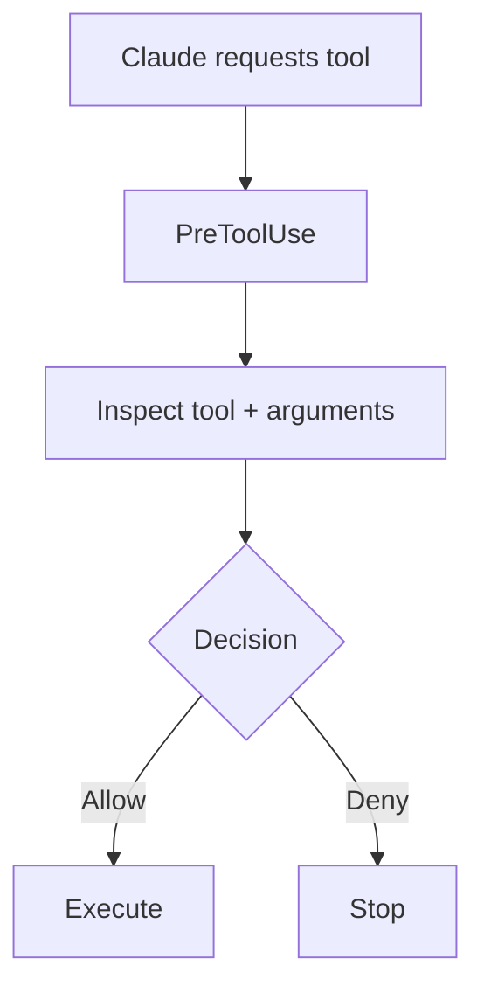

Hooks are useful when a safety decision depends on the actual tool arguments,
not just the tool's name.

## Basic Hook

```python
async def safety_hook(
    input_data,
    tool_use_id,
    context,
):
    tool_name = input_data["tool_name"]
    tool_input = input_data.get(
        "tool_input",
        {},
    )

    print(tool_name)
    print(tool_input)

    return {}
```

The hook can inspect:

```python
input_data["tool_name"]
```

and:

```python
input_data["tool_input"]
```

## Registering a Hook

```python
from claude_agent_sdk.types import HookMatcher
```

```python
options = ClaudeAgentOptions(
    cwd=".",
    hooks={
        "PreToolUse": [
            HookMatcher(
                matcher=None,
                hooks=[
                    safety_hook,
                ],
            )
        ]
    },
)
```

---

# 8. Blocking Dangerous Bash Commands

Bash is a good example of a tool that is genuinely useful but also genuinely
dangerous. Rather than banning it outright, this section shows how to keep it
available while surgically blocking the specific commands that could cause
real harm.

A Bash tool can execute many useful operations. A `PreToolUse` hook can
inspect the requested command before execution.

## Dangerous Command Patterns

```python
import re

DANGEROUS_BASH_PATTERNS = [
    (
        r"rm\s+-rf",
        "recursive force delete",
    ),
    (
        r"sudo",
        "privilege escalation",
    ),
    (
        r"chmod\s+777",
        "unsafe file permissions",
    ),
    (
        r"curl.*\|.*bash|wget.*\|.*bash",
        "remote code execution",
    ),
    (
        r">\s*/etc/",
        "writing to system config",
    ),
]
```

## Safety Hook

```python
async def block_dangerous_bash(
    input_data,
    tool_use_id,
    context,
):
    if input_data["tool_name"] == "Bash":

        command = input_data.get(
            "tool_input",
            {},
        ).get(
            "command",
            "",
        )

        for pattern, reason in DANGEROUS_BASH_PATTERNS:

            if re.search(pattern, command):

                return {
                    "continue_": False,
                    "hookSpecificOutput": {
                        "hookEventName": input_data[
                            "hook_event_name"
                        ],
                        "permissionDecision": "deny",
                        "permissionDecisionReason": (
                            f"Blocked for safety: {reason}. "
                            "Please use a safer alternative."
                        ),
                    },
                }

    return {}
```

## Registering the Hook

```python
options = ClaudeAgentOptions(
    cwd=".",
    allowed_tools=[
        "Bash",
    ],
    model=MODEL_NAME,
    hooks={
        "PreToolUse": [
            HookMatcher(
                matcher=None,
                hooks=[
                    block_dangerous_bash,
                ],
            )
        ]
    },
)
```

## `permissionDecision`

A hook can return:

```python
"permissionDecision": "allow"
```

or:

```python
"permissionDecision": "deny"
```

A denial can include:

```python
"permissionDecisionReason": (
    "Blocked for safety."
)
```

These fields are how a hook communicates its tool-level safety decision back
to the SDK.

## `continue_`

For dangerous Bash operations, the example returns:

```python
"continue_": False
```

This stops the agent flow after the dangerous pattern is detected. Without
it, a model that gets one dangerous command blocked will often just try a
different phrasing of the same destructive action — `continue_: False` cuts
that off immediately rather than playing whack-a-mole.

  [[X]] `continue_: False` stops the whole agent session so the model cannot retry a blocked destructive command with a reformulated version.
  [[ ]] `continue_: False` only blocks that single tool call and lets the agent try something else immediately.

---

# 9. Protecting Sensitive Paths

Bash commands aren't the only danger — a `Write` or `Edit` call pointed at the
wrong path can be just as damaging. This section applies the same
hook-based approach to filesystem destinations.

File operations can be restricted according to their destination.

The example protects:

```text
/etc/
/usr/
~/.ssh/
~/.bashrc
~/.bash_profile
~/.zshrc
/root/
```

## Path Patterns

```python
SENSITIVE_PATH_PATTERNS = [
    (
        r"^/etc/",
        "system configuration directory",
    ),
    (
        r"^/usr/",
        "system directory",
    ),
    (
        r"~/.ssh/",
        "SSH keys directory",
    ),
    (
        r"~/.bashrc|~/.bash_profile|~/.zshrc",
        "shell configuration",
    ),
    (
        r"^/root/",
        "root home directory",
    ),
]
```

## Path Safety Hook

```python
async def block_sensitive_paths(
    input_data,
    tool_use_id,
    context,
):
    if input_data["tool_name"] in [
        "Write",
        "Edit",
    ]:

        file_path = input_data.get(
            "tool_input",
            {},
        ).get(
            "file_path",
            "",
        )

        for pattern, reason in SENSITIVE_PATH_PATTERNS:

            if re.search(pattern, file_path):

                return {
                    "hookSpecificOutput": {
                        "hookEventName": input_data[
                            "hook_event_name"
                        ],
                        "permissionDecision": "deny",
                        "permissionDecisionReason": (
                            f"Writing to {file_path} "
                            f"was blocked: {reason}. "
                            "Please write only within "
                            "the project directory."
                        ),
                    }
                }

    return {}
```

For this file-path example, the agent can retry using a different path rather
than terminating the complete session — unlike the dangerous-Bash case, a
retry here usually converges toward a *safe* outcome, so there's no need for
`continue_: False`.

---

# 10. Modifying Tool Input

Denying isn't the only option available to a hook. Instead of rejecting a
call outright, you can quietly rewrite its arguments and let it proceed —
useful for sandboxing writes without breaking the agent's task.

A hook can modify the input provided to a tool.

Define a safe directory:

```python
SAFE_DIRECTORY = "blocking_demo"
```

A requested path such as:

```text
/tmp/output.txt
```

can be transformed into:

```text
blocking_demo/output.txt
```

## Redirecting the Path

```python
import os

async def redirect_to_safe_directory(
    input_data,
    tool_use_id,
    context,
):
    if input_data["tool_name"] in [
        "Write",
        "Edit",
    ]:

        file_path = input_data.get(
            "tool_input",
            {},
        ).get(
            "file_path",
            "",
        )

        if not file_path.startswith(
            SAFE_DIRECTORY
        ):

            safe_path = (
                f"{SAFE_DIRECTORY}/"
                f"{os.path.basename(file_path)}"
            )

            return {
                "hookSpecificOutput": {
                    "hookEventName": input_data[
                        "hook_event_name"
                    ],
                    "permissionDecision": "allow",
                    "updatedInput": {
                        **input_data["tool_input"],
                        "file_path": safe_path,
                    },
                }
            }

    return {}
```

## `updatedInput`

The modified tool input is returned through:

```python
"updatedInput"
```

The execution flow becomes:

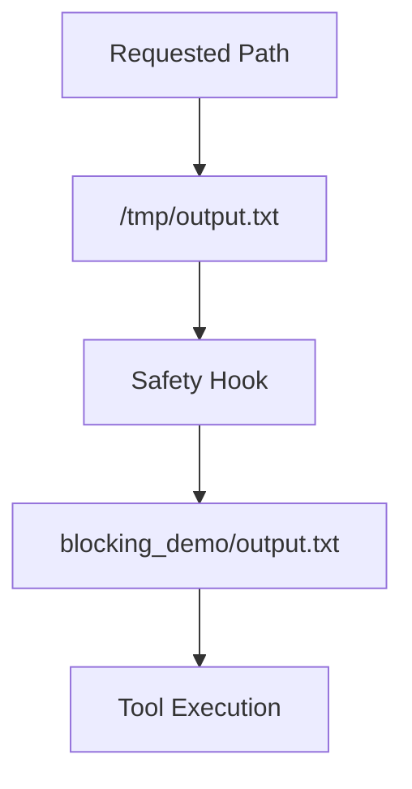

The agent believes it wrote to `/tmp/output.txt` — the file actually lands in
`blocking_demo/output.txt`. This is sandboxing by silent redirection.

---

# 11. User Input and `canUseTool`

Not every permission decision should be automated. Sometimes the right call
is to pause and ask a human. `canUseTool` is the SDK's mechanism for that —
distinct from, and complementary to, the automated `PreToolUse` hooks covered
above.

`canUseTool` provides application-controlled permission handling.

A callback can inspect the requested tool and return a permission result.

```python
async def can_use_tool(
    tool_name,
    input_data,
    context,
):
    if tool_name == "AskUserQuestion":
        return await handle_ask_user_question(
            input_data
        )

    return PermissionResultAllow(
        updated_input=input_data
    )
```

## `AskUserQuestion`

An agent can request information from the user before continuing.

The Safe Code Review Agent uses two questions:

```text
Review focus

- Comprehensive
- Security only
- Quality only
```

and:

```text
Report format

- Summary
- Detailed
```

The selected values are then used during the review.

## `canUseTool` and `PreToolUse`

These mechanisms have different responsibilities:

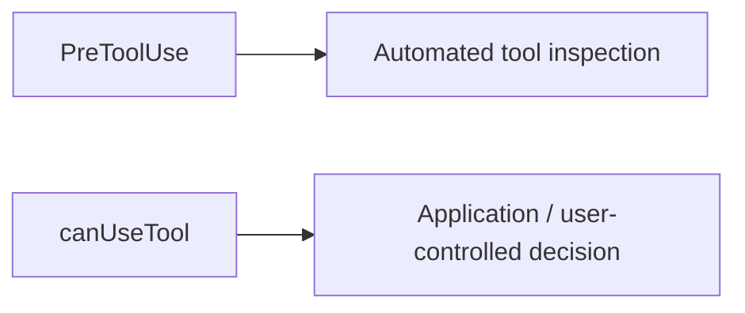

A typical layered agent uses `canUseTool` to handle `AskUserQuestion` while a
separate safety hook handles automated tool restrictions — they run
independently and don't interfere with each other.

  [[X]] `canUseTool` is for application- or user-controlled decisions; `PreToolUse` hooks are for automated inspection.
  [[ ]] `canUseTool` and `PreToolUse` are two names for the exact same mechanism.

---

# 12. Layered Safety

We now have five independent tools: allow rules, deny rules, a permission
mode, hooks, and `canUseTool`. Real production agents rarely rely on just
one — they stack several together so that a gap in one layer is caught by
another.

Multiple permission controls can be combined into a single agent
configuration.

A layered design can contain:

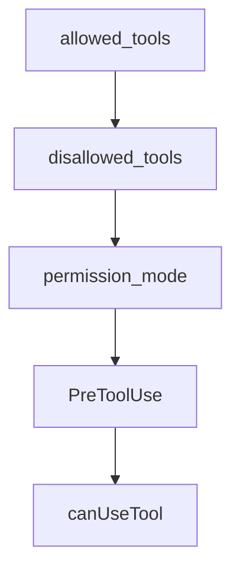

## Layered Configuration

```python
ClaudeAgentOptions(
    cwd=".",

    allowed_tools=[
        "Read",
        "Glob",
        "Grep",
        "AskUserQuestion",
    ],

    disallowed_tools=[
        "Write",
        "Edit",
        "Bash",
    ],

    can_use_tool=can_use_tool,

    model=MODEL_NAME,

    hooks={
        "PreToolUse": [
            HookMatcher(
                matcher=None,
                hooks=[
                    safety_hook,
                ],
            )
        ]
    },
)
```

The resulting tool surface is:

```text
Read / Glob / Grep
    → available

AskUserQuestion
    → handled by canUseTool

Write / Edit / Bash
    → explicitly denied

Additional safety checks
    → handled by safety_hook
```

---

# 13. Safe Code Review Agent

This is where every mechanism from the previous twelve sections comes
together into one working example: a read-only reviewer that asks the user
two clarifying questions, explores a codebase, and reports its findings —
without ever being able to modify a file, even if the model tried to.

The final example combines permissions, hooks, and user input into a
read-only code review agent.

The agent performs:

```text
1. Ask clarifying questions
2. Find Python files
3. Search for common issues
4. Read files
5. Generate a report
```

The agent does not modify the codebase.

## Agent Requirements

The agent:

1. Asks two clarifying questions.
2. Uses `Glob` to find Python files.
3. Uses `Grep` to search for common issue patterns.
4. Uses `Read` to inspect files.
5. Produces a structured report.
6. Does not modify files.

## Tool Surface

```python
allowed_tools=[
    "Read",
    "Glob",
    "Grep",
    "AskUserQuestion",
]

disallowed_tools=[
    "Write",
    "Edit",
    "Bash",
]
```

The resulting permissions are:

```text
Read              → Yes
Glob              → Yes
Grep              → Yes
AskUserQuestion   → Yes

Write             → No
Edit              → No
Bash              → No
```

## Workflow

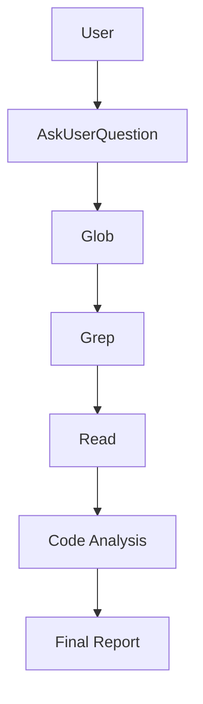

## Verification

After execution, verify that files were not modified.

For a Git repository:

```bash
git diff
```

The expected result is that the source files remain unchanged.

> **Important habit:** never take an agent's own claim of "I didn't modify
> anything" at face value. Independently verify — with `git diff`, a file
> hash, or a direct read-back — every time.

---

# 14. Running the Notebooks

With the concepts covered, here's how to get the accompanying notebooks
running locally so you can experiment with each pattern yourself.

## Clone the Repository

```bash
git clone https://github.com/gopidon/claude-agent-sdk-course-code.git
```

Navigate to the section:

```bash
cd claude-agent-sdk-course-code
cd section-4-permissions-and-safety
```

## Create a Virtual Environment

### Windows

```powershell
python -m venv .venv
.venv\Scripts\activate
```

### macOS / Linux

```bash
python3 -m venv .venv
source .venv/bin/activate
```

## Install Dependencies

If a requirements file is provided:

```bash
pip install -r requirements.txt
```

Otherwise, use the dependency setup provided by the course repository.

## Configure Environment Variables

Configure the API key required by the course.

Example:

```env
ANTHROPIC_API_KEY=your_api_key_here
```

Do not commit API keys or other secrets.

## Start Jupyter

```bash
jupyter notebook
```

or:

```bash
jupyter lab
```

Open the notebooks in sequence:

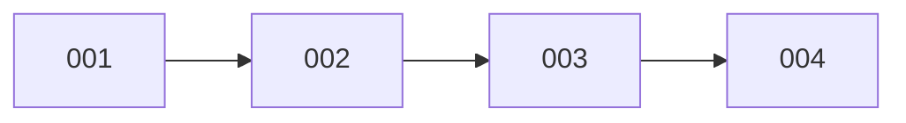

---

# 15. Reference

A quick-lookup summary of everything covered in this section, plus links to
the official documentation for when SDK behavior needs double-checking.

## Notebook Sequence

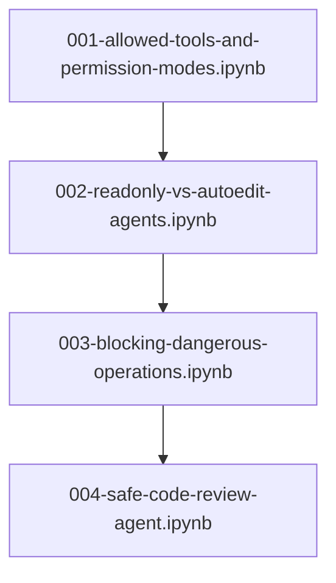

## Permission Controls

```text
allowed_tools
    → Pre-approve tools

disallowed_tools
    → Explicitly deny tools or patterns

permission_mode
    → Define general permission behavior

PreToolUse
    → Inspect tool calls before execution

canUseTool
    → Handle application/user-controlled decisions
```

## Official Documentation

- Claude Agent SDK: https://platform.claude.com/docs/en/agent-sdk
- Permissions: https://platform.claude.com/docs/en/agent-sdk/permissions
- Hooks: https://platform.claude.com/docs/en/agent-sdk/hooks
- User Input: https://platform.claude.com/docs/en/agent-sdk/user-input
- Agent SDK Overview: https://platform.claude.com/docs/en/agent-sdk/overview

---

## Safety

Run permission and safety experiments in a disposable project directory.

Do not test destructive operations against production systems, personal
files, real credentials, SSH configuration, system directories, or shared
environments.

---